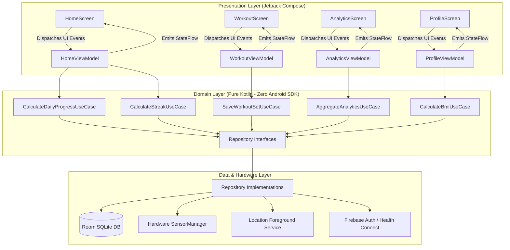
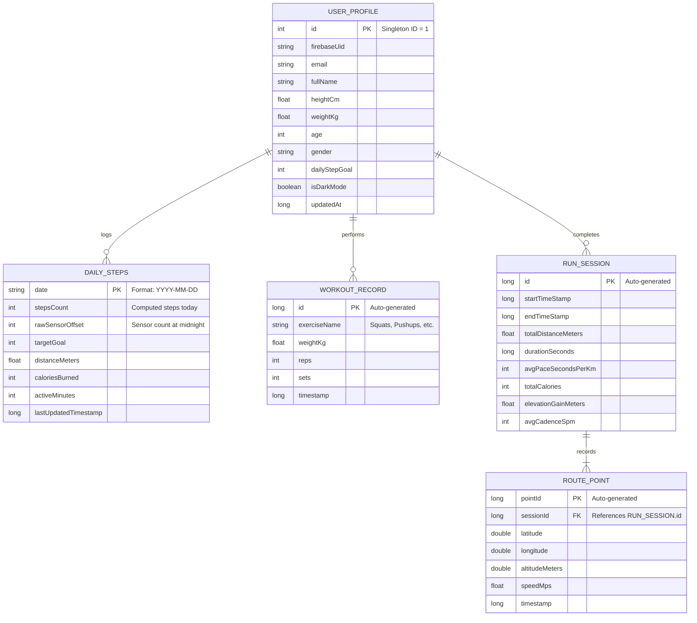
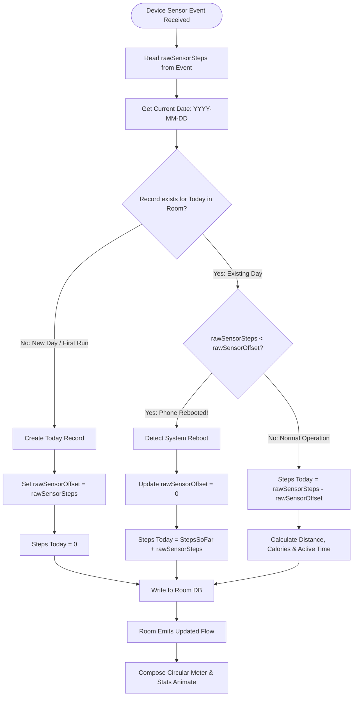
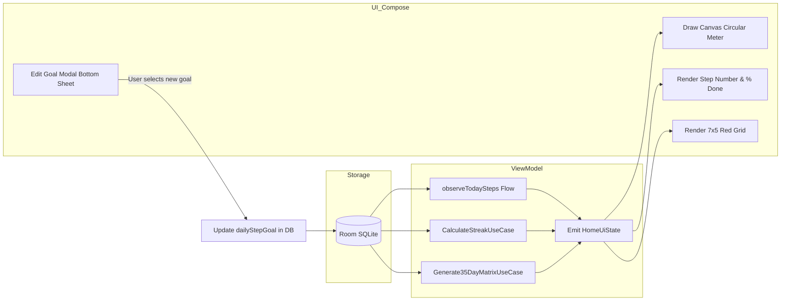
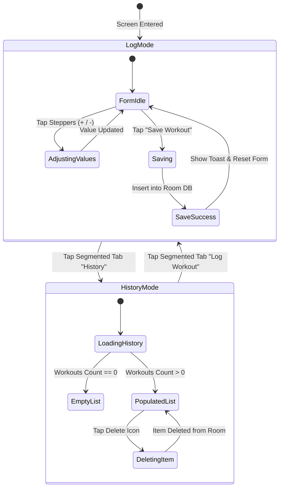

# xtride — Master System Specification & Architecture Manual

> **Version:** 1.0.0-PROD  
> **Status:** Approved / Pre-Development  
> **Application:** `xtride` (Offline-First Android Fitness Platform)  
> **Theme:** Crimson Red Edition (Material 3)  
> **Primary Technology Stack:** Kotlin, Jetpack Compose, Room SQLite, Android Foreground Services, Firebase Auth, Health Connect

---

## 1. Executive Summary & Core Invariants

**xtride** is a commercial-grade, privacy-centric, offline-first mobile fitness tracker built natively for Android. The platform tracks daily steps, calculates activity streaks, logs strength workouts, provides telemetry analytics, calculates real-time body mass index (BMI), and tracks outdoor running sessions without requiring an external smartwatch or an active internet connection.

### The 4 Hard System Invariants
These rules are non-negotiable across the entire codebase:
1. **Local Single Source of Truth (SSOT)**: The local **Room SQLite Database** is the sole source of truth. The UI never queries network or hardware sensors directly; it observes reactive Kotlin `Flow` streams from Room.
2. **Zero-Latency Offline Guarantee**: 100% of core features (step tracking, workout logging, streak calculations, BMI, analytics) must function on an airplane with zero network connection.
3. **Zero Data Loss Across Hardware Reboots**: Because `Sensor.TYPE_STEP_COUNTER` resets to 0 when an Android phone reboots, the data layer must calibrate against a persistent baseline offset stored in SQLite.
4. **Strict Battery Conservation**: Continuous sensor sampling must never acquire wake-locks that prevent CPU deep sleep. Location tracking is restricted exclusively to active, user-initiated running sessions via an Android `ForegroundService`.

---

## 2. High-Level System Architecture

The application strictly adheres to **Clean Architecture** and **Unidirectional Data Flow (UDF)**.



---

## 3. SOLID Principles Implementation Matrix

Every component in the codebase maps to a specific SOLID principle:

| Principle | Architectural Rule in `xtride` | Implementation Target |
| :--- | :--- | :--- |
| **S** (Single Responsibility) | A class has only one reason to change. | • Composables render UI only.<br>• ViewModels manage UI state only.<br>• UseCases execute one specific business rule.<br>• `StepSensorManager` handles hardware accelerometer callbacks only. |
| **O** (Open/Closed) | Open for extension, closed for modification. | Activity types (Walking, Running, Strength) are defined via a sealed hierarchy `ActivityType`. Adding a new type (e.g., Cycling) requires zero changes to the storage or calculation engine. |
| **L** (Liskov Substitution) | Subtypes must be substitutable for their base types. | `FakeStepRepository` and `RoomStepRepositoryImpl` both implement `StepRepository`. ViewModels run against both in unit tests without knowing the difference. |
| **I** (Interface Segregation) | No client should depend on methods it does not use. | Repositories are split into discrete contracts: `StepReader`, `StepWriter`, `WorkoutRepository`, `UserProfileRepository`. |
| **D** (Dependency Inversion) | High-level modules depend on abstractions, not concretions. | ViewModels and UseCases never instantiate databases or services directly; all dependencies are injected as interfaces via **Hilt**. |

---

## 4. Complete Data Architecture & Room Database Schema

### 4.1 Entity-Relationship (ER) Schema



---

## 5. Hardware Sensor Engine & Reboot Calibration Flowchart

The standard Android `Sensor.TYPE_STEP_COUNTER` returns total steps taken **since the last system reboot**. It does **not** reset at midnight, and it resets to **0** when the device powers off.

The flowchart below specifies how `xtride` guarantees continuous, accurate step tracking across reboots and midnight transitions:



---

## 6. Screen State Machines (FSM) & Flowcharts

### 6.1 Home Screen: Circular Progress & Streak Matrix Flowchart



### 6.2 Workout Logging & History State Machine



---

## 7. Design System Specifications (Crimson Red Edition)

### 7.1 Color Palette Hierarchy

```
Primary Accent (Crimson Red):        #E11D48 (Light/Dark CTAs, Circular Meter Foreground)
Secondary Accent (Coral / Rose):     #FB7185 (Gradients, Badges, Highlights)
Dark Background (Obsidian):          #020617 (OLED Deep Slate-Black)
Dark Elevated Surface (Slate 900):   #0F172A (Card Containers, Bottom Sheets)
Light Background (Off-White):        #F8FAFC (Soft slate-tinted canvas)
Light Elevated Surface:              #FFFFFF (Pure White elevated cards)
Border / Subtle Divider:             #1E293B (Dark) / #E2E8F0 (Light)
```

### 7.2 5-Week (35-Day) Heatmap Scale (Red Edition)

| Level | Step Threshold | Light Mode Fill | Dark Mode Fill |
| :---: | :---: | :---: | :---: |
| **0** | `< 1,500 steps` | `#F1F5F9` | `#1E293B` |
| **1** | `1,500 – 3,499 steps` | `#FECDD3` | `#4C0519` |
| **2** | `3,500 – 4,999 steps` | `#FB7185` | `#881337` |
| **3** | `5,000 – 5,999 steps` | `#F43F5E` | `#BE123C` |
| **4** | `≥ 6,000 steps (Goal Met ⭐)` | `#E11D48` | `#FB7185` |

---

## 8. Phased SDLC Execution Roadmap

This blueprint enforces a strict phase-by-phase development cadence:

```mermaid
gantt
    title xtride Implementation Lifecycle
    dateFormat  YYYY-MM-DD
    section Phase 1: Domain & Contracts
    Define Models & Invariants        :p1_1, 2026-09-20, 2d
    Pure Kotlin UseCases & Unit Tests  :p1_2, after p1_1, 3d
    section Phase 2: Data & Hardware
    Room SQLite Database & DAOs        :p2_1, after p1_2, 3d
    StepSensorManager & Calibration    :p2_2, after p2_1, 3d
    section Phase 3: UI Architecture
    Crimson Design Tokens & Typography :p3_1, after p2_2, 2d
    Navigation Scaffold & Bottom Bar   :p3_2, after p3_1, 2d
    section Phase 4: Feature Slices
    Slice 1: Home Screen & Meter Arc   :p4_1, after p3_2, 4d
    Slice 2: Workout Log & History     :p4_2, after p4_1, 3d
    Slice 3: Analytics & Reports       :p4_3, after p4_2, 3d
    Slice 4: Profile, BMI & Auth       :p4_4, after p4_3, 3d
    section Phase 5: Hardening & Release
    R8 Minification & Play Policy      :p5_1, after p4_4, 3d
    AAB Build & Google Play Submission :p5_2, after p5_1, 2d
```

---

## 9. Verification & Quality Gates

Before any phase is marked complete, it must pass these quality gates:

1. **Architecture Integrity**: No Composable file imports a database DAO or sensor class directly.
2. **Deterministic State**: Every screen has a corresponding `UiState` data class and handles Loading, Content, Empty, and Error states cleanly.
3. **Battery Compliance**: Background step collection executes via hardware event triggers without holding indefinite CPU wake-locks.
4. **Android 14/15 Compliance**: Explicit declaration of `FOREGROUND_SERVICE_TYPE_HEALTH` and `FOREGROUND_SERVICE_TYPE_LOCATION` with appropriate runtime permission checks.
